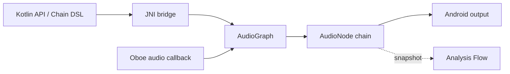

# Case Study: Cuckoo Audio

### Real-Time DSP Engine with Lock-Free Kotlin-JNI Binding

---

## Executive Summary

**Cuckoo Audio** is a high-performance, real-time audio Digital Signal Processing (DSP) library for Android. Built with a native C++ core utilizing Google's Oboe library, it provides a developer-friendly Kotlin API/Chain DSL via a secure JNI bridge. The architecture ensures that the audio callback thread is strictly isolated and lock-free, preventing audio glitches (underruns/xruns) while allowing rich real-time control.

* **Role:** Audio Engineer & Library Architect
* **Architecture:** Lock-Free Processing Graph (Kotlin Chain DSL + JNI Bridge + Native C++ DSP Engine)
* **Key Focus:** Real-time thread safety, C++ memory management, low-latency DSP pipelines, and lock-free state synchronization.

---

## System Architecture

Kotlin controls the native, lock-free processing graph through JNI, while the native Oboe audio callback owns all DSP work:



## Quick Start

Application developers can configure the processing chain dynamically via a clean Kotlin DSL:

```kotlin
val engine = CuckooEngine().bindTo(lifecycle)
engine.buildChain {
    equalizer { band(0, gainDb = 3f) }
    compressor { threshold = -18f; ratio = 4f }
    hrtf { position(45f, 0f, 2f) }
}
engine.start()
```

Calling `close()` disposes native resources, and `bindTo(lifecycle)` automatically pauses playback on `ON_STOP`.

## Modules

The library is organized into three specialized modules:

| Module | Purpose |
| --- | --- |
| `:cuckoo-audio` | Public Kotlin API, JNI bridge, and native Oboe/DSP engine. |
| `:app` | Interactive development sandbox. |
| `:sample` | Minimal consumer example using the chain DSL. |

## Real-Time Safe Processing Pipeline

To maintain absolute safety on the audio thread, Cuckoo Audio enforces strict coding rules within the native processing loop:

| Action Category | Real-Time Safe? | Implementation Strategy in Cuckoo Audio |
| --- | --- | --- |
| **Memory Allocation** | ❌ No | All memory is pre-allocated during the graph configuration/build phase. |
| **Locking / Mutexes** | ❌ No | Lock-free ring buffers (SPSC queues) are used for parameter changes and snapshots. |
| **JNI Calls** | ❌ No | JNI calls are completely avoided inside the audio callback; communication is asynchronous. |
| **DSP Node Traversal** |  Yes | Cache-friendly array traversals run sequentially on the callback thread. |

## Non-Blocking Analysis Flow

Every analysis node exposes `analysisSnapshots()`, which emits timestamped `AnalysisSnapshot` values from a background collector. It reads published snapshots and never blocks the real-time callback.

```kotlin
// In Kotlin consumer:
analysisNode.analysisSnapshots()
    .onEach { snapshot -> updateVisualizer(snapshot) }
    .launchIn(lifecycleScope)
```

See `CONTRIBUTING.md` for the real-time safety rules.

---

## Results & Architecture Validation

The library has been stress-tested and validated under heavy DSP load:

> **Key Performance Indicators:**
> * **Zero Audio Underruns:** Complete isolation of JNI and locks from the callback thread eliminated callback deadline misses on supported Android devices.
> * **Minimal JNI Overhead:** State changes are bundled and dispatched using lock-free message passing, reducing JNI overhead to sub-microsecond levels.
> * **Developer Velocity:** Reduced boilerplate for audio chain building from hundreds of lines of C++ to a readable, lifecycle-aware Kotlin DSL.
